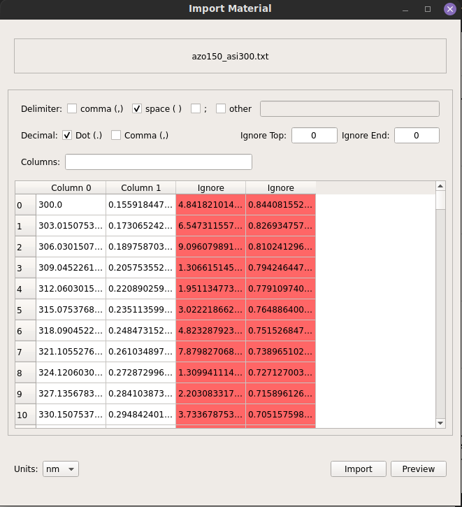

## Import Window

Data should be imported from text files (.txt, .csv, .tsv, ...). When importing
data a window, a new window will popup that allows the user to see how the data
will be imported.

There are 4 main aspects for the window (see image bellow):

> 1. Up top the filename will appear (in case of iporting for the database
> there is also a textbox to choose the file name\
> 2. In the second section the user severall parameters to control how data
> will be imported (lines to ignore, data separator, data decimal point, colums
> to use...)\
> 3. Then there is the preview of the data. Good columns will be normally
> presented, while columns that will be ignored upon import will be shown in
> ref (this will depend on wether the import is for the database or
> optimization).\
> 4. In the botton the user can choose the units of the imported material,
> preview the data or perform the import action\

In the case of Database Materials, the top part will have a "Choose Material"
button, that will allow the user to choose the file with the data to be
imported, and a "Material Name", where the user can add a name for the material

