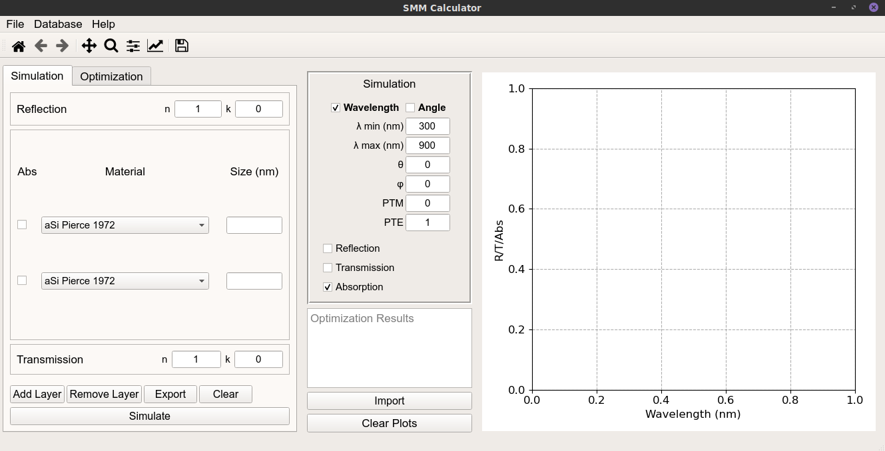
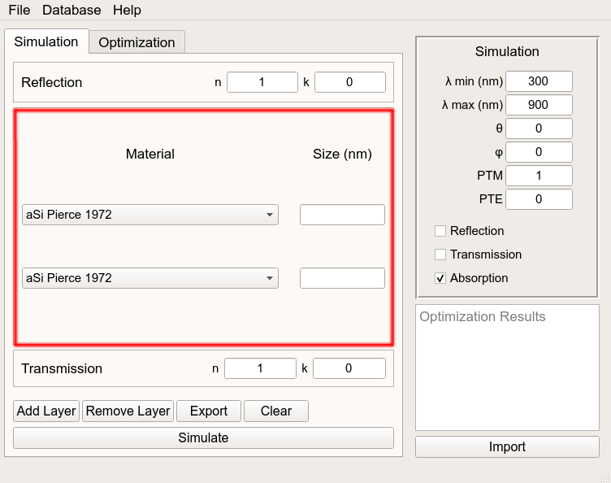
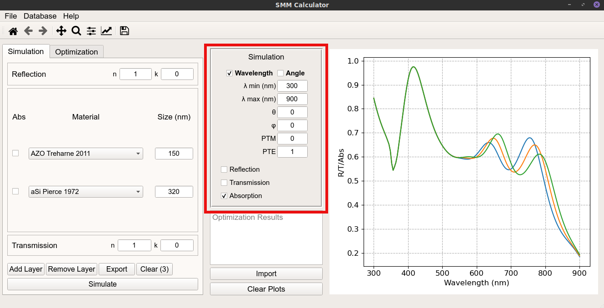

## Main Interface {#main_interface}

The initial interface of the program is shown in the following image.
There are 4 main sections for the interface:
 
> * __Action menus (top)__: Provide some configurations and access to the database\
> * __Simulation/Optimization region (left)__: Where the materials/properties for the simulation are defined\
> * __Simulation properties (center)__: Where the exact simulation configurations are defined\
> * __Results Preview (right)__: Where the results of the simulation are plotted for visualization\

{width=100%}

## Simulation Region

The simulation is defined by 3 main regions. Firstly, the reflection region
(the topmost region) that defines the medium above the device (from where light
comes). Secondly, the transmission region that defines the medium after light
passes through the device. Here, both the media are defined in terms of their
non-dispersive real and complex refractive indexes (the default values are for
air medium). Lastly, in the middle, the device can be defined (by default a
2-layer material is defined as seen in the image bellow). Layers can be
added/removed to/from the bottom of the stack by clicking the respective
buttons (Add Layer and Remove Layer). Each layer is composed of 3 parts:

> * __Layer Absorption (left):__ This checkbox allows adds the absorption of a particular
> layer to the simulation (it requires a previous simulation to work). These checkboxes
> calculate the absorption cumulatively. For example, if a two layer simulation is run,
> clicking on the absorption checkbox of the first material will add the absorption for
> that material. Clicking on the checkbox for the second material, the absorption of
> both layers will be plotted (that, for the referred case, is the total absorption of
> the device).\
> * __Layer Material (center)__: Select the material for a particular layer. The materials
> provided are stored in the internal Database. More materials can be added ([Database](Manage Database.md))\
> * __Layer thickness (right)__: Define the thickness of a particular layer

{width=100%}

## Simulation Properties {#sim_properties}

The middle section has the Simulation properties (image bellow). On the topmost part,
it is possible to select the preferred simulation mode (Wavelength/Angle). Bellow, the
various variables for the simulation can be chosen, depending on the simulation mode.
The simulation variables are as follows:\

> * __Wavelength (λ)__: For Wavelength simulations, the minimum and maximum wavelength can be chosen
> to define the simulation range. In Angle simulation only the minimum value can be chosen,
> as the single wavelength to perform the simulation
> * __Angle (θ)__: Polar angle for the incident wave (only available in wavelength simulations,
> as, in angle simulations, it is defined from 0-90\
> * __Phi (Φ)__: Azimuth angle for the incident wave\
> * __Polarization (TE/TM)__: Polarization components for the incident wave
> * __Reflection/Transmission/Absorption__: Checkboxes to define which variables should be simulated

{width=100%}

## Other Buttons {#sim_type}

In the middle part of the interface, 2 buttons (*Import* and *Clear Plots*) are also provided
to help during the simulation process. The first one allows for the user to import external data
that can be compared with current simulations, or, more importantly, to fit using the optimization tab
([Optimization](Optimization.md)). The *Clear Plots* button will clear all the plots present in the
*Results Preview* region (it is important to note that any stored simulation will not be cleared)

[Return to Home page](help.md)
