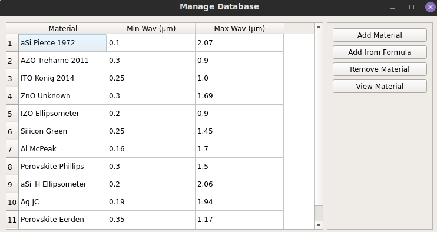
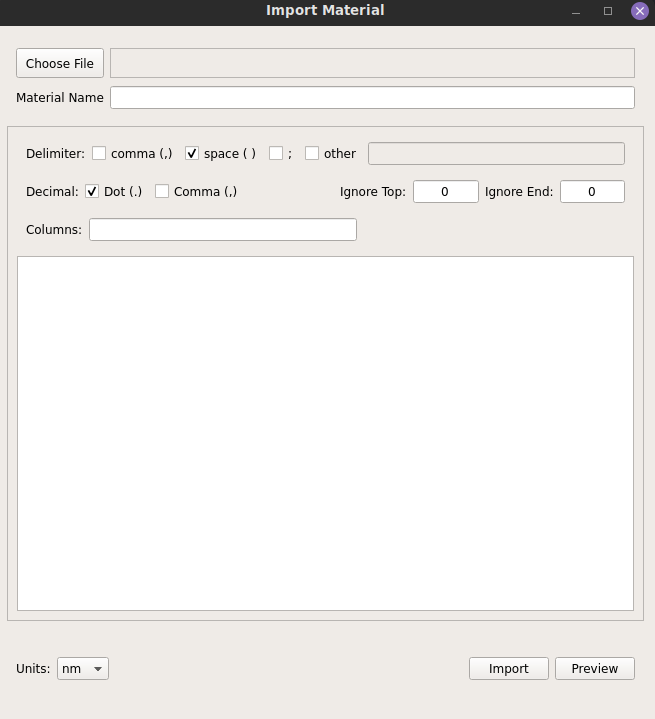

## Accessing the Database

The database can be accessed by the Main interface Database → Manage Database
menu, opening a new window where the database materials can be previewed and adapted.

Each of the most important parameters for each database material is shown in 3 different
columns, "Material", "Min Wav", "Max Wav". The first shows the material name,
and the next two provide the wavelength range where the stored database values
are defined. These last values are particularly useful to guarantee that the
material is adequately defined for a possible simulation range. Simulations and
optimizations are limited to the wavelength range where all materials in that
particular simulation/optimization are defined.

## Database Actions

The database provides three different interactions:

> * __Add Material__: To add a new material to the database (see more below)\
> * __Add from Formula__: Add a new material from a predefined formula\
> * __Remove Material__: Remove the currently selected material from the database\
> * __View Material__: Preview the stored real refractive index, complex\
>  refractive index and their respective interpolations for a particular\
>  material\

## Adding New Materials

### Material from pre-existing data

Material info can be added from a file containing the necessary information.
For this, the user can click the "Add Material" button, where a new interface
will appear (see the image bellow). In this interface, the user can define the
relevant information for importing the data. More details, about imported data
can be seen in [Importing Data](./Import.md).

### Adding from predefined formula

Materials can also be added from predefined dispersion formulas. By clicking
the "Add from Formula" button, a new interface will appear (see image bellow).
There, the user can create the materials by changing the different parameters,
defined by different dispersion relations. The possible dispersion formulas
are:

> 1. __Constant__: To define constant n/k materials\
> 2. __New Amorphous__: Formula that established a Lorentzian shape for the
refractive index and extinction coefficient (Generally good to define
semiconductor materials)\
> 3. __Tauc Lorentz__: Formula defined from the Tauc joint density of states and a
Lorentz oscillator (Generally good for semiconductor materials)\
> 4. __Cauchy and Cauchy Absorbent__: Empirical dispersion law, that generally works
well for materials with no optical absorption in the visible range (The Cauchy
absorbent can be used for weakly absorbing materials)\
> 5. __Sellmeier Absorbent__: Semi-Empirical dispersion very similar to the Cauchy
expression, but more accurate to characterize the refractive index across a
wider spectral range\

Upon choosing the proper dispersion formula, the several parameters will
appear bellow. The user can either scroll the slider, to adjust the parameter
or change the value in the text box just above the slider to adjust to a
particular value. To the sides of the slider, are the minimum (left) and
maximum (right) values defined in the slider. These values can, in most cases,
be changed, to provide better resolution for the slider values (some cases,
like the number of peaks in the Tauc Lorentz and New Amorphous cannot be
changed)

The plot to the right provides a preview for the n and k values for the current
set of chosen parameters. The x variable can be changed (between Energy and
Wavelength), by changing the value in the Units combobox, just bellow the plot.
The x plot limits can also be updated by changing the respective values in the
text boxes bellow the plot.

[Return to Home page](help.md)
