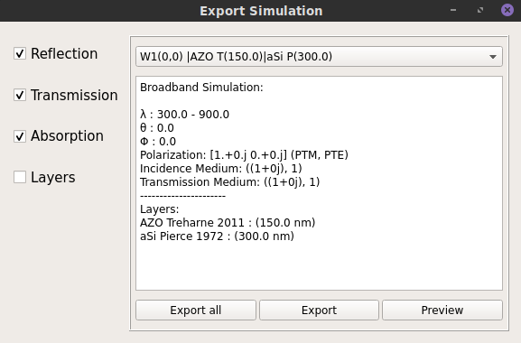

# Starting a Simulation

A simulation is defined by the following parameters:

- min/max wavelength (wavelength range)
- incidence angle (phi/theta)
- incident light polarization (te/tm)
- layer setup (reflection medium/device/transmission medium)
- measurables (reflection/transmission/reflection)

# Simulation

When the "simulate" button is clicked the program will gather the aforementioned information and use it to perform the simulation and then plot the results. The plot will show the results for the different measurables chosen, for instance is reflection/transmission/absorption are all checked then the simulation will plot the results for all three values.

# Multiple Simulation

Multiple simulations can be done sequentially and the results will be plotted on the same plot and stored internally. The number of simulations stored are shown in the clear button ("clear(10)" means there are 10 simulations stored in memory). Clicking the clear button will flush all the results and clear all the open plots.

# Exporting Data

The export button can be used to export simulation results to files. When clicked it will open the following interface.

On the left it is possible to choose with measurables to export. On the right all the simulations are shown with the name describing the simulation setup ((theta, phi)/material name(material thickness)/material name(material thickness)) and then it is possible to preview the respective simulation, export that particular simulation or export all simulations stored

[Return to Home page](help.html)
