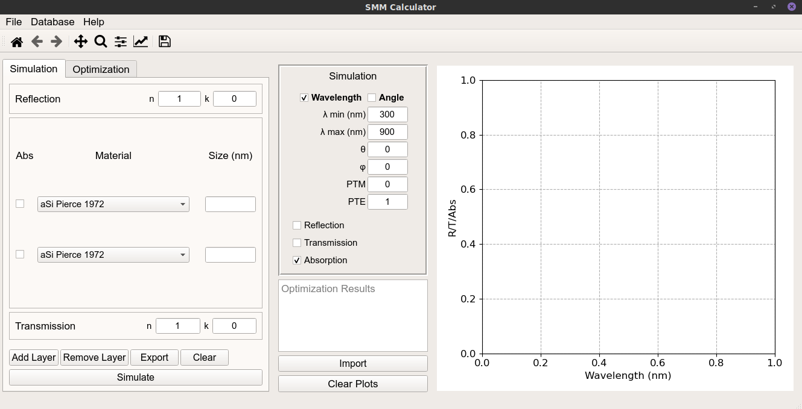

# Transfer Matrix Method Graphical Interface

## Usage Example


## Description

This script implements a graphical interface (on PyQt5) to interact with the transfer matrix method (calculate Reflection/Transmission/Absorption for 1D stacked material layers). The transfer matrix method was developed from the information provided on the Computational Electromagnetics Youtube video series by [EMPossible](https://www.youtube.com/channel/UCPC6uCfBVSK71MnPPcp8AGA).
The program has a database of materials (easily expanded with new materials), that is used to perform the calculations.
This program allows for:
* Calculation of Reflection/Transmission/Absorption for arbitrarily sized stacks of planar materials
* Export the results of simulations to text files
* Import data to compare with simulations
* Thickness fitting from imported data (using a particle swarm algorithm to find the thickness combination for all layers that minimizes the error between the simulation algorithm and the imported data.

The program was written using the following version of different python packages (although it should also work with any recent version of these packages)

* python 3.8.8
* pandas 1.3.1
* numpy 1.19.2
* scipy 1.6.2
* matplotlib 3.3.4
* pyqt 5.9.2

The program can be run from python

```python
python scatmm.py
```

The script can be also run from IDEs, although it is important to guarantee that all the required packages are properly installed in the virtual environment.
In spyder it may also be necessary to change the matplotlib backend to automatic in the settings.

When run the program will display the image bellow.
The help menu provides a brief description of all the program's capabilities


